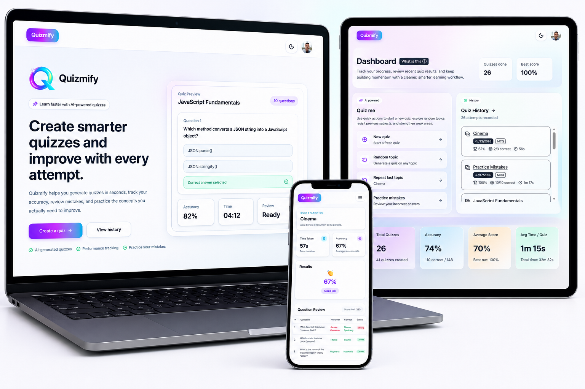
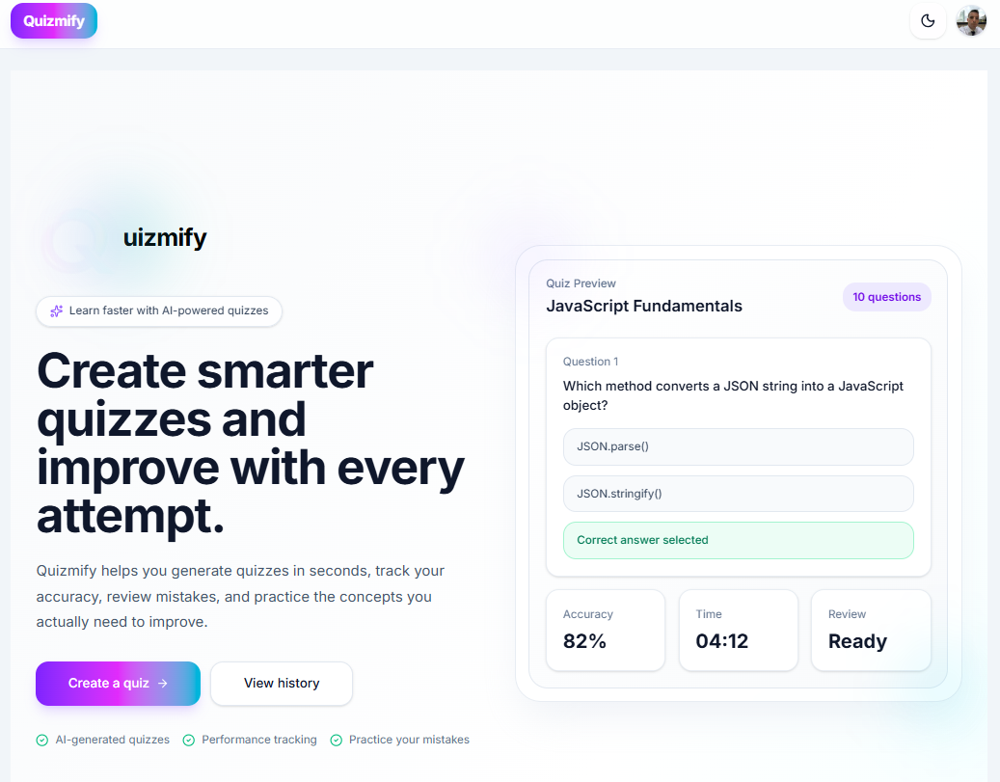
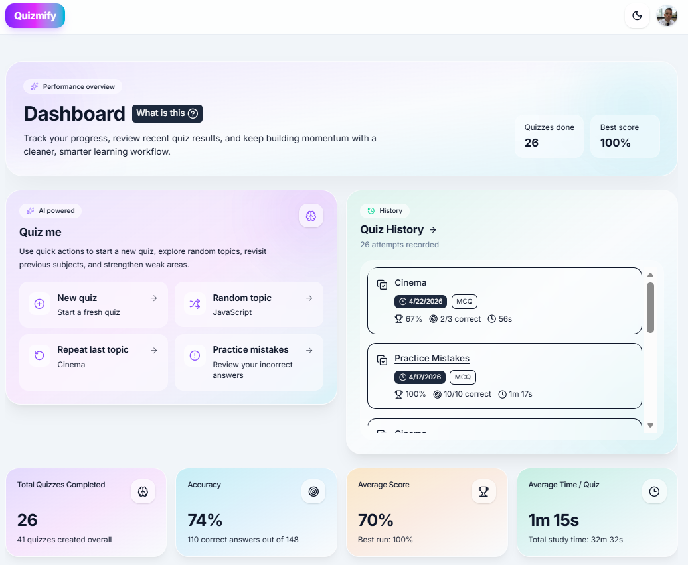
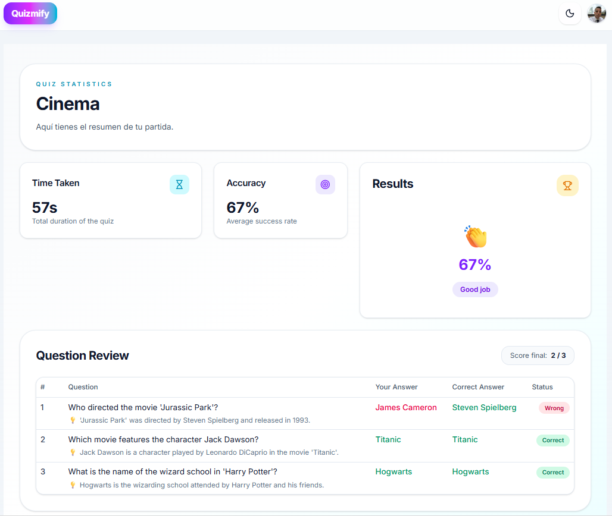

# Quizmify

AI-powered quiz generation platform with persistent learning and performance tracking.

## 🌐 Live Demo

https://quizmify-two.vercel.app/

---

## ✨ Concept

Quizmify is a modern learning platform that transforms any topic into an interactive quiz using AI.

Users can instantly generate quizzes, practice dynamically, track their performance, and improve over time through data-driven feedback.

---

## 🧠 How it works

1. Enter a topic or prompt
2. AI generates structured quiz questions
3. Complete the quiz interactively
4. Review results and track performance
5. Improve with history and mistake analysis

---

## 🚀 Features

* AI-generated quiz questions
* Real-time quiz interaction
* Performance tracking dashboard
* Quiz history & progress analysis
* Mistake review system
* Clean and modern UX
* Fully responsive interface

---

## 💡 Use Cases

* Students learning new topics
* Developers practicing concepts
* Interview preparation
* Training platforms
* EdTech products

---

## 🛠️ Tech Stack

* Next.js
* TypeScript
* Supabase
* OpenAI API
* Tailwind CSS
* Framer Motion

---

## 📸 Preview

<p align="center">
  
</p>

---

## 📊 Experience

### Quiz Generation

<p align="center">
  
</p>

### Dashboard & History

<p align="center">
  
</p>

### Results & Review

<p align="center">
  
</p>

---

## 🔐 Security

Environment variables and API keys are not included in this repository.

Refer to `.env.example` for required configuration.

---

## 📁 Environment Variables

Create a `.env.local` file:

```env
NEXT_PUBLIC_SUPABASE_URL=
NEXT_PUBLIC_SUPABASE_ANON_KEY=
SUPABASE_SERVICE_ROLE_KEY=
OPENAI_API_KEY=
```

---


## 📌 Project Status

Quizmify is a functional AI-powered application showcasing how modern technologies can be combined to build interactive, scalable and data-driven learning tools.

---

## 🚀 Vision

This project can evolve into a full SaaS platform including:

* User authentication & accounts
* Personalized learning paths
* Subscription-based model
* Advanced analytics & insights
